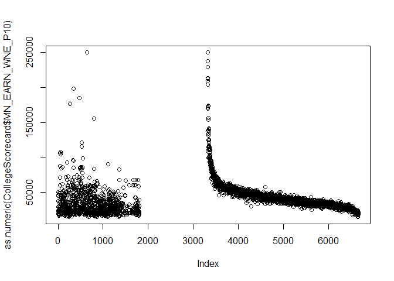
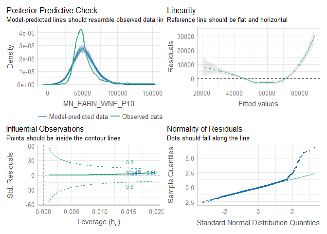

College Ranking Analysis
================

## College Rankings

The quality and cost of college in the US is a pretty widely discussed
topic. Many college rankings systems exist that attempt to answer the
question of which colleges are ‘the best’ in order to give parents and
students information to make an informed decision about which colleges
to attend.

However, each of these ranking systems mixes inputs - like the average
income SAT scores of students - with outputs, such as the percent
employed six months after graduation. Thus they are ‘scoring’ colleges
without truly modelling their impact.

This modelling project is an attempt to measure the *impact* of
attending a particular college for students. That is, all things being
equal, how much impact does attending one college over another have on
outcomes for a student with similar characteristics?

## Starting Point - Getting the Data

The ability to do this type of analysis has been greatly enhanced in
recent years with the availability of the [College
Scorecard](https://collegescorecard.ed.gov/) which contains
comprehensive institution-level information on colleges in the United
States. The college scorecard data set used in this analysis is the most
recently released annual data from May 2022.

## Starting Point for this Analysis

The basic idea behind this research is this: some amount of the relative
success of college graduates is determined by factors inherent to those
individuals, while some can be attributed to the impact of which college
they chose to attend. Because the data we have is at the
institution-level, we cannot actually model on individuals - but we do
have student population characteristics at the institutional level.

The CollegeScorecard file we imported has 6662 observations of 2989
variables - a lot to work with. To start with, we’re going to visualize
some of this data, figure out what filters we need to apply, and then
build a very simple first model.

### Identifying a Dependent Variable

First, let’s look at potential dependent variables for our model:
long-term earnings. The data contains a number of post-graduation
earnings measures, but the longest-term ones are the median and mean
earnings for students 10 years post-entry. Note that in both cases these
are earnings for graduates who are ‘working, not enrolled’ so would
presumably not include students enrolled in a graduate program at this
time - more on that later.

``` r
plot(as.numeric(CollegeScorecard$MD_EARN_WNE_P10))
```

<!-- -->

``` r
plot(as.numeric(CollegeScorecard$MN_EARN_WNE_P10))
```

<!-- -->

The first thing to notice here is that it looks like we have almost two
different datasets. There are also some schools with very, very high
long-term earnings: these are likely schools that only offer
high-earning graduate programs like standalone medical schools. We want
to filter to four-year degree granting institutions.

The data dictionary contains a variable called
degrees_awarded.predominant with the following characteristics:

0 Not classified 1 Predominantly certificate-degree granting 2
Predominantly associate’s-degree granting 3 Predominantly
bachelor’s-degree granting 4 Entirely graduate-degree granting

Let’s add a filter for degrees_awarded.predominant = 3 and see what
difference it makes.

``` r
filtered_scorecard <- CollegeScorecard %>% filter(PREDDEG == 3)
plot(filtered_scorecard$MD_EARN_WNE_P10)
```

<!-- -->

``` r
plot(filtered_scorecard$MN_EARN_WNE_P10)
```

<!-- -->

That looks much better. To add a qualitative check, let’s see what the
top five schools with the highest mean earnings are in this data.

``` r
filtered_scorecard %>% slice_min(order_by=MN_EARN_WNE_P10,n=5) %>%
  select(INSTNM)
```

    ## # A tibble: 5 × 1
    ##   INSTNM                                      
    ##   <chr>                                       
    ## 1 Texas Tech University Health Sciences Center
    ## 2 Cornell University                          
    ## 3 University of Chicago                       
    ## 4 Carnegie Mellon University                  
    ## 5 Tufts University

``` r
filtered_scorecard %>% slice_min(order_by=MD_EARN_WNE_P10,n=5) %>%
  select(INSTNM)
```

    ## # A tibble: 5 × 1
    ##   INSTNM                               
    ##   <chr>                                
    ## 1 University of Pennsylvania           
    ## 2 Babson College                       
    ## 3 Bentley University                   
    ## 4 Harvey Mudd College                  
    ## 5 Massachusetts Institute of Technology

If we go by mean earnings the schools with highest earnings 10 years
post-graduation are: Texas Tech Health Sciences Center, Cornell,
University of Chicago, Carnegie Mellon, and Tufts. By median its Penn,
Babson, Bentley, Harvey Mudd, and MIT. The only school that looks like
it maybe should not belong on this list is Texas Tech Health Sciences.

There are a few other variables we can use to make sure we’re looking at
the right list of schools. Let’s look are our remaining \~2000 colleges
using the Carnegie Classification Profile:

``` r
filtered_scorecard %>% group_by(CCUGPROF) %>% select(INSTNM) %>% summarise(count=n())
```

    ## Adding missing grouping variables: `CCUGPROF`

    ## # A tibble: 13 × 2
    ##    CCUGPROF count
    ##    <chr>    <int>
    ##  1 -2          53
    ##  2 0           14
    ##  3 10         137
    ##  4 11         360
    ##  5 12         192
    ##  6 13         312
    ##  7 14         291
    ##  8 15         128
    ##  9 5          221
    ## 10 6           14
    ## 11 7          162
    ## 12 8            4
    ## 13 9          126

We still have a few schools that are either graduate-only or don’t have
a classification. Let’s remove them.

``` r
filtered_scorecard <- filtered_scorecard %>% filter(CCUGPROF != 0,CCUGPROF != -2)
```

Now that we’ve done that, let’s see if we can generate a slightly
cleaner plot of our data. Our two potential dependent variables are mean
and median income ten years post-graduation, so let’s plot them. We’ll
also use ggplot2 this time to get a better looking chart than the ones
available in base R.

``` r
ggplot(filtered_scorecard,aes(y=as.numeric(MN_EARN_WNE_P10),x=as.numeric(MD_EARN_WNE_P10))) +
  geom_point() +
  scale_y_continuous(labels=scales::dollar_format(),breaks=c(25000,50000,75000,100000,125000,150000,175000)) +
  scale_x_continuous(labels=scales::dollar_format(),breaks=c(25000,50000,75000,100000,125000,150000,175000)) +
  xlab("Median Income 10 Years Post Graduation") + 
  ylab("Mean Income 10 Years Post Graduation")
```

    ## Warning in FUN(X[[i]], ...): NAs introduced by coercion

    ## Warning in FUN(X[[i]], ...): NAs introduced by coercion

    ## Warning: Removed 229 rows containing missing values (geom_point).

<!-- -->

Two principle takeaways from this: first, we got a warning that about
\~200 schools are missing income values, so we need to remove those from
the dataset. Second, for universities with the highest income post
graduation, the averages can be quite a bit higher than the medians.
Based on this, I think it’s better to go with median income as our
dependent variable. But we’ll try it with both for the first model.

Now let’s think about what we might use to build a basic model. Let’s
start with a simple linear model with just a couple of features.
Thinking about a students background and their academic credentials,
let’s see how much variation in 10 year post-graduation income can be
attributed to household income, first generation status, and average SAT
scores.

``` r
# Clear out all null values, and then make sure all features we're going to use are coded as numeric
first_model_scorecard <- filtered_scorecard %>%
  select(UNITID,INSTNM,SAT_AVG,MD_FAMINC,FIRST_GEN,MN_EARN_WNE_P10,MD_EARN_WNE_P10) %>%
  filter(SAT_AVG != 'NULL',MD_FAMINC != 'NULL',FIRST_GEN != 'PrivacySuppressed') %>%
  filter(MN_EARN_WNE_P10 != 'NULL',MN_EARN_WNE_P10 != 'PrivacySuppressed') %>%
  filter(MD_EARN_WNE_P10 != 'NULL',MN_EARN_WNE_P10 != 'PrivacySuppressed') %>%
  mutate_at(vars(-("INSTNM")), as.numeric)

#define model with only a few predictors
fm_1 <- lm(MN_EARN_WNE_P10 ~ SAT_AVG + MD_FAMINC + FIRST_GEN,data=first_model_scorecard)
fm_2 <- lm(MD_EARN_WNE_P10 ~ SAT_AVG + MD_FAMINC + FIRST_GEN,data=first_model_scorecard)
```

With only these three features - average SAT, median family income, and
percent of first generation students, the R^2 for both models is about
.58, indicating that \~58% of the variation in 10 year post entry income
for colleges can be explained by these three variables alone. This seems
like a promising starting point for further digging.

For one final step, let’s run some basic model diagnostics. Base R has
built-in functionality for this, but I much prefer the performance
package. We’ll run it first for the model based on mean income.

``` r
library(performance)

model_performance(fm_1)
```

    ## # Indices of model performance
    ## 
    ## AIC       |       BIC |    R2 | R2 (adj.) |     RMSE |    Sigma
    ## ---------------------------------------------------------------
    ## 21929.584 | 21954.286 | 0.581 |     0.580 | 9805.851 | 9824.891

``` r
check_model(fm_1,dot_size=1,line_size = .5,show_dots='false',
            check=c("pp_check","linearity","qq","outliers"))
```

<!-- -->

Now, let’s see how the model does for the same features and median
income as the dependent variable:

``` r
library(performance)

model_performance(fm_2)
```

    ## # Indices of model performance
    ## 
    ## AIC       |       BIC |    R2 | R2 (adj.) |     RMSE |    Sigma
    ## ---------------------------------------------------------------
    ## 21660.102 | 21684.803 | 0.580 |     0.579 | 8606.711 | 8623.423

``` r
check_model(fm_2,dot_size=1,line_size = .5,show_dots='false',
            check=c("pp_check","linearity","qq","outliers"))
```

<!-- -->

As we would expect, the diagnostics indicate that we have a lot more to
do.

It also doesn’t seem like there’s a ton of difference between the two
dependent variables - so we’ll stick with my original intuition and use
median income going forward.

As a next step, lets add some additional variables to the model -
focusing on characteristics of students that are independent of the
university that they attend. This includes demographic information
including race/ethnicity, family income, standardized test information,
dependent status, and the demographic profile of students’ home zip
codes.

<b>An important note: I am making no claims here about ‘why’ any of the
above demographic variables are likely to impact the income of college
graduate 10 years post-graduation. I am merely attempting to gather all
the information I can about the profile of students at each university
in order to account for those differences when comparing universities to
each other. </b>

Additionally, we will include variables that indicate the percent of
students choosing distinct types of majors at each university. We know
that certain majors are likely to result in higher incomes independent
of which university students attend, so we want to account for the fact
that the ‘mix’ of majors at some universities is very different than
others. We don’t want having more engineering majors to drive how much
impact a college has on students’ income.

``` r
# Follow the same steps as previously, but keep additional columns that we want to use for the model
second_model_scorecard <- filtered_scorecard %>%
  select(UNITID,
        INSTNM,          # Institution Name
        SAT_AVG,         # Average SAT Score
#        MN_EARN_WNE_P10, # Mean Income 10 Years After Graduating. We are modelling based on median not mean
        SATVRMID,        # SAT Midpoint Critical Reading
        SATMTMID,        # SAT Midpoint Math
#        SATWRMID,        # SAT Midpoint Writing / Excluded because most colleges do not report this
        ACTCMMID,        # Cumulative ACT Midpoint
        FAMINC,          # Family Income
        MD_FAMINC,       # Median Family Income
        FIRST_GEN,       # Percent First Generation Students
        FEMALE,          # Percent Female
        MD_EARN_WNE_P10, # Median Income 10 Years After Grad
        PCIP01,          # Percent enrolled in different degree programs
        PCIP03,
        PCIP04,
        PCIP05,
        PCIP09,
        PCIP10,
        PCIP11,
        PCIP12,
        PCIP13,
        PCIP14,
        PCIP15,
        PCIP16,
        PCIP19,
        PCIP22,
        PCIP23,
        PCIP24,
        PCIP25,
        PCIP26,
        PCIP27,
        PCIP29,
        PCIP30,
        PCIP31,
        PCIP38,
        PCIP39,
        PCIP40,
        PCIP41,
        PCIP42,
        PCIP43,
        PCIP44,
        PCIP45,
        PCIP46,
        PCIP47,
        PCIP48,
        PCIP49,
        PCIP50,
        PCIP51,
        PCIP52,
        PCIP54,
        UGDS_WHITE, # Demographic characteristics of Undergraduate student pop
        UGDS_BLACK,
        UGDS_HISP,
        UGDS_ASIAN,
        UGDS_AIAN,
        UGDS_NHPI,
        UGDS_2MOR,
        UGDS_NRA,
        UGDS_UNKN,
        AGE_ENTRY,
        AGEGE24,
        DEPENDENT,
#         VETERAN,       # Wanted to include % of veterans but most colleges do not report this
        PCT_WHITE, # Demographic characteristics of home zip codes of student pop
        PCT_BLACK,
        PCT_ASIAN,
        PCT_HISPANIC,
        PCT_BA,
        PCT_GRAD_PROF,
        PCT_BORN_US,
        MEDIAN_HH_INC,
        POVERTY_RATE,
        UNEMP_RATE) %>%
  filter(SAT_AVG != 'NULL',MD_FAMINC != 'NULL',FIRST_GEN != 'PrivacySuppressed') %>%
#  filter(MN_EARN_WNE_P10 != 'NULL',MN_EARN_WNE_P10 != 'PrivacySuppressed') %>%
  filter(MD_EARN_WNE_P10 != 'NULL',MD_EARN_WNE_P10 != 'PrivacySuppressed') %>%
  mutate_at(vars(-("INSTNM")), as.numeric) 

# summary(second_model_scorecard)
```

Taking a look at the data in each column, we exclude a few variables -
median SAT writing score and veteran status that most colleges don’t
report. It also appears that a number of colleges don’t have % female,
but most of them are actually all-female colleges. Those will have to be
manually corrected as follows. We will then drop remaining rows with
missing values.

``` r
second_model_scorecard <- second_model_scorecard %>%
  mutate(FEMALE = ifelse(is.na(FEMALE),
                      case_when(UNITID == 174792 ~ 0,
                                UNITID == 217961 ~ NA_real_,
                                TRUE ~ 1),FEMALE)) %>%
  drop_na()
```

Let’s now split data into testing and training datasets in order to test
the model accuracy, and then re-run the model on the test data using all
the variables

``` r
#make this example reproducible
set.seed(1)

#create ID column
second_model_scorecard$id <- 1:nrow(second_model_scorecard)

#use 70% of dataset as training set and 30% as test set 
train <- second_model_scorecard %>% dplyr::sample_frac(0.75)
test  <- dplyr::anti_join(second_model_scorecard, train, by = 'id')

#define model with all predictors
all <- lm(MD_EARN_WNE_P10 ~ . - UNITID - INSTNM - id, data=train)
```

Now, let’s check the performance of this second model:

``` r
# library(performance)

model_performance(all)
```

    ## # Indices of model performance
    ## 
    ## AIC       |       BIC |    R2 | R2 (adj.) |     RMSE |    Sigma
    ## ---------------------------------------------------------------
    ## 14125.783 | 14440.396 | 0.863 |     0.848 | 4853.344 | 5105.439

``` r
check_model(all,dot_size=1,line_size = .5,show_dots='false',
            check=c("pp_check","linearity","qq","outliers"))
```

<!-- -->

With these additional variables included, the predictive power of our
model goes from .58 to .86. However, it’s likely we have included too
many features, so we’ll try a backwards stepwise regression to focus on
the most important ones.

``` r
#perform backward stepwise regression
backward <- step(all, direction='backward', scope=formula(all), trace=0)

#view results of backward stepwise regression
model_performance(backward)
```

    ## # Indices of model performance
    ## 
    ## AIC       |       BIC |    R2 | R2 (adj.) |     RMSE |    Sigma
    ## ---------------------------------------------------------------
    ## 14075.924 | 14235.510 | 0.859 |     0.852 | 4916.101 | 5038.932

``` r
check_model(backward,dot_size=1,line_size = .5,show_dots='false',
            check=c("pp_check","linearity","qq","outliers"))
```

<!-- -->

Now, the idea is that whatever remains should tell us which colleges
benefit students the most independent of other factors. The colleges
that have the greatest impact on income should be those with the
greatest difference between the actual value and predicted value.

``` r
# Plot actual versus predicted
plot(predict(backward),                                # Draw plot using Base R
     train$MD_EARN_WNE_P10,
     xlab = "Predicted Values",
     ylab = "Observed Values")
abline(a = 0,                                        # Add straight line
       b = 1,
       col = "red",
       lwd = 2)
```

<!-- -->

``` r
# New DataSet Showing Predicted And Actual
modeled_results <- cbind(train,predict(backward)) %>%
  rename("modeled_salary" = "predict(backward)") %>%
  mutate(value_add =MD_EARN_WNE_P10 - modeled_salary) %>%
  select(INSTNM,MD_EARN_WNE_P10,modeled_salary,value_add)

# Top Ten Colleges with highest 'Value Add'
modeled_results %>%
  mutate(INSTNM = str_trunc(INSTNM,30)) %>%
  filter(rank(desc(value_add))<=10) %>%
  arrange(desc(value_add))
```

    ##                             INSTNM MD_EARN_WNE_P10 modeled_salary value_add
    ## 344 University of Health Scienc...          121576       73273.98  48302.02
    ## 562 Albany College of Pharmacy ...          119112       81253.97  37858.03
    ## 167             Bentley University          107974       84862.64  23111.36
    ## 650     University of the Sciences           98779       79777.98  19001.02
    ## 119          Georgetown University           96375       79798.13  16576.87
    ## 21               Bryant University           91105       75722.83  15382.17
    ## 213 DigiPen Institute of Techno...           89916       75248.11  14667.89
    ## 518 Massachusetts Institute of ...          111222       97191.89  14030.11
    ## 654 Massachusetts Maritime Academy           91668       80034.49  11633.51
    ## 520 Linfield University-McMinnv...           66898       55313.75  11584.25

Some of the top 10 schools with the biggest ‘value add’ make sense -
Georgetown, MIT. Others are specialty schools that focus on a specific
type of degree program (pharmacy). It may be better to remove these
schools from the analysis as outliers as they don’t represent ‘normal’
colleges.

It’s also possible that a non-parametric model might do a better job in
these types of cases. Gradient boosted decision trees tend to
consistently win modelling competitions (and we use them often in my
team in my actual job) so let’s see if we get a different result by
using the XGBoost model on the data.

``` r
library(xgboost)
```

    ## 
    ## Attaching package: 'xgboost'

    ## The following object is masked from 'package:dplyr':
    ## 
    ##     slice

``` r
library(caret)
```

    ## Loading required package: lattice

    ## 
    ## Attaching package: 'caret'

    ## The following object is masked from 'package:purrr':
    ## 
    ##     lift

``` r
#make this example reproducible
set.seed(0)

#split into training (80%) and testing set (20%)
parts = createDataPartition(second_model_scorecard$UNITID, p = .8, list = F)
train = second_model_scorecard[parts, ]
test = second_model_scorecard[-parts, ]

#define predictor and response variables in training set
train_x = data.matrix(train[, c(-11,-1,-2,-72)])
train_y = train$MD_EARN_WNE_P10

#define predictor and response variables in testing set
test_x = data.matrix(test[, c(-11,-1,-2,-72)])
test_y = test$MD_EARN_WNE_P10

#define final training and testing sets
xgb_train = xgb.DMatrix(data = train_x, label = train_y)
xgb_test = xgb.DMatrix(data = test_x, label = test_y)
```

Now let’s run it and see what happens

``` r
#define watchlist
watchlist = list(train=xgb_train, test=xgb_test)

#fit XGBoost model and display training and testing data at each round
model = xgb.train(data = xgb_train, max.depth = 3, watchlist=watchlist, nrounds = 70)
```

    ## [1]  train-rmse:38087.437414 test-rmse:39119.392396 
    ## [2]  train-rmse:27296.368709 test-rmse:28395.801605 
    ## [3]  train-rmse:19820.291552 test-rmse:21129.418330 
    ## [4]  train-rmse:14604.193570 test-rmse:15998.302870 
    ## [5]  train-rmse:11068.525746 test-rmse:12515.836608 
    ## [6]  train-rmse:8640.867679  test-rmse:10059.154610 
    ## [7]  train-rmse:7029.967582  test-rmse:8509.931106 
    ## [8]  train-rmse:5963.949531  test-rmse:7484.351214 
    ## [9]  train-rmse:5237.075413  test-rmse:6890.912635 
    ## [10] train-rmse:4796.151351  test-rmse:6358.558108 
    ## [11] train-rmse:4486.832377  test-rmse:6099.486954 
    ## [12] train-rmse:4222.502927  test-rmse:5970.258073 
    ## [13] train-rmse:4036.638253  test-rmse:5835.890871 
    ## [14] train-rmse:3878.132803  test-rmse:5771.116948 
    ## [15] train-rmse:3740.826024  test-rmse:5660.245552 
    ## [16] train-rmse:3632.717208  test-rmse:5595.533261 
    ## [17] train-rmse:3564.105648  test-rmse:5532.648524 
    ## [18] train-rmse:3465.840336  test-rmse:5488.366613 
    ## [19] train-rmse:3377.357746  test-rmse:5429.134364 
    ## [20] train-rmse:3305.877654  test-rmse:5416.297756 
    ## [21] train-rmse:3248.359029  test-rmse:5402.523568 
    ## [22] train-rmse:3208.023457  test-rmse:5389.388800 
    ## [23] train-rmse:3168.602428  test-rmse:5387.281997 
    ## [24] train-rmse:3129.195385  test-rmse:5388.351013 
    ## [25] train-rmse:3067.915130  test-rmse:5399.627794 
    ## [26] train-rmse:3008.460500  test-rmse:5344.611503 
    ## [27] train-rmse:2956.966975  test-rmse:5333.926939 
    ## [28] train-rmse:2881.468858  test-rmse:5342.795642 
    ## [29] train-rmse:2836.524168  test-rmse:5336.276618 
    ## [30] train-rmse:2799.486265  test-rmse:5350.173886 
    ## [31] train-rmse:2771.753403  test-rmse:5353.562680 
    ## [32] train-rmse:2745.848769  test-rmse:5348.435150 
    ## [33] train-rmse:2711.085284  test-rmse:5337.986200 
    ## [34] train-rmse:2674.860728  test-rmse:5329.318477 
    ## [35] train-rmse:2657.172290  test-rmse:5328.617240 
    ## [36] train-rmse:2632.371199  test-rmse:5312.562336 
    ## [37] train-rmse:2599.863377  test-rmse:5319.586655 
    ## [38] train-rmse:2582.965430  test-rmse:5319.224494 
    ## [39] train-rmse:2560.647818  test-rmse:5321.708037 
    ## [40] train-rmse:2530.159825  test-rmse:5316.297962 
    ## [41] train-rmse:2486.602275  test-rmse:5275.074262 
    ## [42] train-rmse:2459.171488  test-rmse:5251.667597 
    ## [43] train-rmse:2429.897347  test-rmse:5255.810064 
    ## [44] train-rmse:2407.379025  test-rmse:5252.753580 
    ## [45] train-rmse:2369.522843  test-rmse:5249.251093 
    ## [46] train-rmse:2353.984132  test-rmse:5246.887285 
    ## [47] train-rmse:2338.844080  test-rmse:5241.440384 
    ## [48] train-rmse:2312.659149  test-rmse:5247.638459 
    ## [49] train-rmse:2290.906215  test-rmse:5251.977739 
    ## [50] train-rmse:2261.377646  test-rmse:5254.416711 
    ## [51] train-rmse:2242.465247  test-rmse:5257.437835 
    ## [52] train-rmse:2222.187239  test-rmse:5250.791363 
    ## [53] train-rmse:2187.162617  test-rmse:5246.259055 
    ## [54] train-rmse:2153.192490  test-rmse:5242.451370 
    ## [55] train-rmse:2140.965629  test-rmse:5235.082027 
    ## [56] train-rmse:2128.380994  test-rmse:5173.619506 
    ## [57] train-rmse:2094.747467  test-rmse:5183.281186 
    ## [58] train-rmse:2076.160942  test-rmse:5186.790325 
    ## [59] train-rmse:2061.059081  test-rmse:5190.070160 
    ## [60] train-rmse:2045.056554  test-rmse:5180.554237 
    ## [61] train-rmse:2007.256843  test-rmse:5202.721879 
    ## [62] train-rmse:1973.367661  test-rmse:5188.729306 
    ## [63] train-rmse:1944.823004  test-rmse:5189.926307 
    ## [64] train-rmse:1920.668076  test-rmse:5160.145005 
    ## [65] train-rmse:1910.632381  test-rmse:5157.412108 
    ## [66] train-rmse:1896.857793  test-rmse:5148.493814 
    ## [67] train-rmse:1882.992897  test-rmse:5147.609960 
    ## [68] train-rmse:1870.281793  test-rmse:5155.009014 
    ## [69] train-rmse:1856.852680  test-rmse:5144.774355 
    ## [70] train-rmse:1821.521655  test-rmse:5128.802564

We will go with model 23, since the rounds beyond that seem to overfit
the training data.

``` r
#define final model
final = xgboost(data = xgb_train, max.depth = 3, nrounds = 23, verbose = 0)

#use model to make predictions on test data
pred_y = predict(final, xgb_test)
pred_train = predict(final,xgb_train)

mean((test_y - pred_y)^2) #mse
```

    ## [1] 29022807

``` r
caret::MAE(train_y, pred_train) #mae
```

    ## [1] 2407.664

``` r
caret::RMSE(train_y, pred_train) #rmse
```

    ## [1] 3168.602

This result indicates a root mean squared error of about 3168 dollars on
the training data - much better than the linear model which had an RMSE
of about 4700 dollars. Now lets see which schools get the biggest
differences between predicted and actual salaries.

``` r
scored_test <- test
scored_test$pred_income <- pred_y

scored_test <- scored_test %>%
  mutate(value_add = MD_EARN_WNE_P10 - pred_y)

# scored_test %>% filter(rank(desc(value_add))<=10)

scored_train <- train
scored_train$pred_income <- pred_train

scored_train <- scored_train %>%
  mutate(value_add = MD_EARN_WNE_P10 - pred_train)

# scored_train %>% filter(rank(desc(value_add))<=10)

# Combine test and training sets

total_scored <- rbind(scored_test,scored_train)

total_scored %>% select(UNITID,INSTNM,value_add) %>% filter(rank(desc(value_add))<=10) %>% arrange(desc(value_add))
```

    ## # A tibble: 10 × 3
    ##    UNITID INSTNM                                         value_add
    ##     <dbl> <chr>                                              <dbl>
    ##  1 166683 Massachusetts Institute of Technology             21247.
    ##  2 198419 Duke University                                   16215.
    ##  3 188526 Albany College of Pharmacy and Health Sciences    15901.
    ##  4 217165 Bryant University                                 14884.
    ##  5 130794 Yale University                                   14549.
    ##  6 204635 Ohio Northern University                          14295.
    ##  7 120883 University of the Pacific                         13477.
    ##  8 243744 Stanford University                               12851 
    ##  9 166656 MCPHS University                                  11945.
    ## 10 215062 University of Pennsylvania                        11911.

``` r
total_scored %>% select(UNITID,INSTNM,value_add) %>% filter(rank(value_add)<=10) %>% arrange(value_add)
```

    ## # A tibble: 10 × 3
    ##    UNITID INSTNM                            value_add
    ##     <dbl> <chr>                                 <dbl>
    ##  1 150774 Holy Cross College                  -16138.
    ##  2 120865 Pacific Union College               -14233.
    ##  3 219295 Presentation College                -11777.
    ##  4 130314 University of Saint Joseph          -10255.
    ##  5 126614 University of Colorado Boulder       -9970.
    ##  6 239017 Lawrence University                  -9825.
    ##  7 228787 The University of Texas at Dallas    -9562.
    ##  8 175421 Belhaven University                  -9192.
    ##  9 217013 Wilson College                       -9049.
    ## 10 169080 Calvin University                    -8508.

``` r
# Plot actual versus predicted
plot(total_scored$pred_income,                                # Draw plot using Base R
     total_scored$MD_EARN_WNE_P10,
     xlab = "Predicted Values",
     ylab = "Observed Values")
abline(a = 0,                                        # Add straight line
       b = 1,
       col = "red",
       lwd = 2)
```

<!-- -->

The final result makes sense - attending MIT causes the most significant
value add of any college - about \$21k in annual income 10 years
post-graduation. The list of schools which generate the highest negative
value add doesn’t seem to have any clear pattern.

<b>Note: This remains a work in progress. A few additional steps I am
planning to add are some amount of cross-validation on the training data
and continued review of the available features to see if there any other
ones I may have left out.</b>
