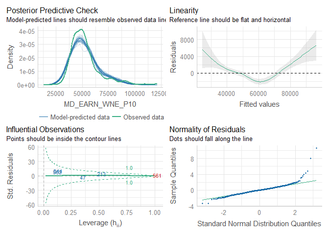

College Ranking Analysis
================

## College Rankings

The quality and cost of college in the US is a pretty widely discussed
topic. Many college rankings systems exist that attempt to answer the
question of which colleges are ‘the best’ in order to give parents and
students information to make an informed decision about which colleges
to attend.

However, each of these ranking systems mixes inputs - like the average
income SAT scores of students - with outputs, such as the percent
employed six months after graduation. Thus they are ‘scoring’ colleges
without truly modelling their impact.

This modelling project is an attempt to measure the *impact* of
attending a particular college for students. That is, all things being
equal, how much impact does attending one college over another have on
outcomes for a student with similar characteristics?

## Starting Point - Getting the Data

The ability to do this type of analysis has been greatly enhanced in
recent years with the availability of the [College
Scorecard](https://collegescorecard.ed.gov/) which contains
comprehensive institution-level information on colleges in the United
States. The college scorecard data set used in this analysis is the most
recently released annual data from May 2022.

## Starting Point for this Analysis

The basic idea behind this research is this: some amount of the relative
success of college graduates is determined by factors inherent to those
individuals, while some can be attributed to the impact of which college
they chose to attend. Because the data we have is at the
institution-level, we cannot actually model on individuals - but we do
have student population characteristics at the institutional level.

The CollegeScorecard file we imported has 6662 observations of 2989
variables - a lot to work with. To start with, we’re going to visualize
some of this data, figure out what filters we need to apply, and then
build a very simple first model.

### Identifying a Dependent Variable

First, let’s look at potential dependent variables for our model:
long-term earnings. The data contains a number of post-graduation
earnings measures, but the longest-term ones are the median and mean
earnings for students 10 years post-entry. Note that in both cases these
are earnings for graduates who are ‘working, not enrolled’ so would
presumably not include students enrolled in a graduate program at this
time - more on that later.

``` r
plot(CollegeScorecard$MD_EARN_WNE_P10)
```

    ## Warning in xy.coords(x, y, xlabel, ylabel, log): NAs introduced by coercion

<!-- -->

``` r
plot(CollegeScorecard$MN_EARN_WNE_P10)
```

    ## Warning in xy.coords(x, y, xlabel, ylabel, log): NAs introduced by coercion

<!-- -->

The first thing to notice here is that it looks like we have almost two
different datasets. There are also some schools with very, very high
long-term earnings: these are likely schools that only offer
high-earning graduate programs like standalone medical schools. We want
to filter to four-year degree granting institutions.

The data dictionary contains a variable called
degrees_awarded.predominant with the following characteristics:

0 Not classified 1 Predominantly certificate-degree granting 2
Predominantly associate’s-degree granting 3 Predominantly
bachelor’s-degree granting 4 Entirely graduate-degree granting

Let’s add a filter for degrees_awarded.predominant = 3 and see what
difference it makes.

``` r
filtered_scorecard <- CollegeScorecard %>% filter(PREDDEG == 3)
plot(filtered_scorecard$MD_EARN_WNE_P10)
```

    ## Warning in xy.coords(x, y, xlabel, ylabel, log): NAs introduced by coercion

<!-- -->

``` r
plot(filtered_scorecard$MN_EARN_WNE_P10)
```

    ## Warning in xy.coords(x, y, xlabel, ylabel, log): NAs introduced by coercion

<!-- -->

That looks much better. To add a qualitative check, let’s see what the
top five schools with the highest mean earnings are in this data.

``` r
filtered_scorecard %>% slice_min(order_by=MN_EARN_WNE_P10,n=5) %>%
  select(INSTNM)
```

    ## # A tibble: 5 × 1
    ##   INSTNM                                      
    ##   <chr>                                       
    ## 1 Texas Tech University Health Sciences Center
    ## 2 Cornell University                          
    ## 3 University of Chicago                       
    ## 4 Carnegie Mellon University                  
    ## 5 Tufts University

``` r
filtered_scorecard %>% slice_min(order_by=MD_EARN_WNE_P10,n=5) %>%
  select(INSTNM)
```

    ## # A tibble: 5 × 1
    ##   INSTNM                               
    ##   <chr>                                
    ## 1 University of Pennsylvania           
    ## 2 Babson College                       
    ## 3 Bentley University                   
    ## 4 Harvey Mudd College                  
    ## 5 Massachusetts Institute of Technology

If we go by mean earnings the schools with highest earnings 10 years
post-graduation are: Texas Tech Health Sciences Center, Cornell,
University of Chicago, Carnegie Mellon, and Tufts. By median its Penn,
Babson, Bentley, Harvey Mudd, and MIT. The only school that looks like
it maybe should not belong on this list is Texas Tech Health Sciences.

There are a few other variables we can use to make sure we’re looking at
the right list of schools. Let’s look are our remaining \~2000 colleges
using the Carnegie Classification Profile:

``` r
filtered_scorecard %>% group_by(CCUGPROF) %>% select(INSTNM) %>% summarise(count=n())
```

    ## Adding missing grouping variables: `CCUGPROF`

    ## # A tibble: 13 × 2
    ##    CCUGPROF count
    ##    <chr>    <int>
    ##  1 -2          53
    ##  2 0           14
    ##  3 10         137
    ##  4 11         360
    ##  5 12         192
    ##  6 13         312
    ##  7 14         291
    ##  8 15         128
    ##  9 5          221
    ## 10 6           14
    ## 11 7          162
    ## 12 8            4
    ## 13 9          126

We still have a few schools that are either graduate-only or don’t have
a classification. Let’s remove them.

``` r
filtered_scorecard <- filtered_scorecard %>% filter(CCUGPROF != 0,CCUGPROF != -2)
```

Now let’s think about what we might use to build a basic model. Let’s
start with a simple linear model with just a couple of features.
Thinking about a students background and their academic credentials,
let’s see how much variation in 10 year post-graduationg income can be
attributed to houshold income, first generation status, and average SAT
scores.

``` r
# Clear out all null values, and then make sure all features we're going to use are coded as numeric
first_model_scorecard <- filtered_scorecard %>%
  select(UNITID,INSTNM,SAT_AVG,MD_FAMINC,FIRST_GEN,MN_EARN_WNE_P10,MD_EARN_WNE_P10) %>%
  filter(SAT_AVG != 'NULL',MD_FAMINC != 'NULL',FIRST_GEN != 'PrivacySuppressed') %>%
  filter(MN_EARN_WNE_P10 != 'NULL',MN_EARN_WNE_P10 != 'PrivacySuppressed') %>%
  filter(MD_EARN_WNE_P10 != 'NULL',MN_EARN_WNE_P10 != 'PrivacySuppressed') %>%
  mutate_at(vars(-("INSTNM")), as.numeric)

#define model with only a few predictors
fm_1 <- lm(MN_EARN_WNE_P10 ~ SAT_AVG + MD_FAMINC + FIRST_GEN,data=first_model_scorecard)
fm_2 <- lm(MD_EARN_WNE_P10 ~ SAT_AVG + MD_FAMINC + FIRST_GEN,data=first_model_scorecard)
```

With only these three features - average SAT, median family income, and
percent of first generation students, the R^2 for both models is about
.58, indicating that \~58% of the variation in 10 year post entry income
for colleges can be explained by these three variables alone. This seems
like a promising starting point for further digging.

For one final step, let’s run some basic model diagnostics. Base R has
built-in functionality for this, but I much prefer the performance
package:

``` r
library(performance)

model_performance(fm_1)
```

    ## # Indices of model performance
    ## 
    ## AIC       |       BIC |    R2 | R2 (adj.) |     RMSE |    Sigma
    ## ---------------------------------------------------------------
    ## 21929.584 | 21954.286 | 0.581 |     0.580 | 9805.851 | 9824.891

``` r
check_model(fm_1)
```

<!-- -->

As we would expect, the diagnostics indicate that we have a lot more to
do. But it’s a good start. As a next step, lets add some additional
variables to the model - focusing on characteristics of students that
are independent of the university that they attend.

``` r
# Follow the same steps as previously, but keep additional columns that we want to use for the model
second_model_scorecard <- filtered_scorecard %>%
  select(UNITID,
        INSTNM,          # Institution Name
        SAT_AVG,         # Average SAT Score
#        MN_EARN_WNE_P10, # Mean Income 10 Years After Graduating. We are modelling based on median not mean
        SATVRMID,        # SAT Midpoint Critical Reading
        SATMTMID,        # SAT Midpoint Math
#        SATWRMID,        # SAT Midpoint Writing / Excluded because most colleges do not report this
        ACTCMMID,        # Cumulative ACT Midpoint
        FAMINC,          # Family Income
        MD_FAMINC,       # Median Family Income
        FIRST_GEN,       # Percent First Generation Students
        FEMALE,          # Percent Female
        MD_EARN_WNE_P10, # Median Income 10 Years After Grad
        PCIP01,          # Percent enrolled in different degree programs
        PCIP03,
        PCIP04,
        PCIP05,
        PCIP09,
        PCIP10,
        PCIP11,
        PCIP12,
        PCIP13,
        PCIP14,
        PCIP15,
        PCIP16,
        PCIP19,
        PCIP22,
        PCIP23,
        PCIP24,
        PCIP25,
        PCIP26,
        PCIP27,
        PCIP29,
        PCIP30,
        PCIP31,
        PCIP38,
        PCIP39,
        PCIP40,
        PCIP41,
        PCIP42,
        PCIP43,
        PCIP44,
        PCIP45,
        PCIP46,
        PCIP47,
        PCIP48,
        PCIP49,
        PCIP50,
        PCIP51,
        PCIP52,
        PCIP54,
        UGDS_WHITE,
        UGDS_BLACK,
        UGDS_HISP,
        UGDS_ASIAN,
        UGDS_AIAN,
        UGDS_NHPI,
        UGDS_2MOR,
        UGDS_NRA,
        UGDS_UNKN,
        AGE_ENTRY,
        AGEGE24,
        DEPENDENT,
#         VETERAN,       # Wanted to include % of veterans but most colleges do not report this
        PCT_WHITE,
        PCT_BLACK,
        PCT_ASIAN,
        PCT_HISPANIC,
        PCT_BA,
        PCT_GRAD_PROF,
        PCT_BORN_US,
        MEDIAN_HH_INC,
        POVERTY_RATE,
        UNEMP_RATE) %>%
  filter(SAT_AVG != 'NULL',MD_FAMINC != 'NULL',FIRST_GEN != 'PrivacySuppressed') %>%
#  filter(MN_EARN_WNE_P10 != 'NULL',MN_EARN_WNE_P10 != 'PrivacySuppressed') %>%
  filter(MD_EARN_WNE_P10 != 'NULL',MD_EARN_WNE_P10 != 'PrivacySuppressed') %>%
  mutate_at(vars(-("INSTNM")), as.numeric) 
```

    ## Warning in mask$eval_all_mutate(quo): NAs introduced by coercion

    ## Warning in mask$eval_all_mutate(quo): NAs introduced by coercion

    ## Warning in mask$eval_all_mutate(quo): NAs introduced by coercion

    ## Warning in mask$eval_all_mutate(quo): NAs introduced by coercion

    ## Warning in mask$eval_all_mutate(quo): NAs introduced by coercion

    ## Warning in mask$eval_all_mutate(quo): NAs introduced by coercion

    ## Warning in mask$eval_all_mutate(quo): NAs introduced by coercion

    ## Warning in mask$eval_all_mutate(quo): NAs introduced by coercion

    ## Warning in mask$eval_all_mutate(quo): NAs introduced by coercion

    ## Warning in mask$eval_all_mutate(quo): NAs introduced by coercion

    ## Warning in mask$eval_all_mutate(quo): NAs introduced by coercion

    ## Warning in mask$eval_all_mutate(quo): NAs introduced by coercion

    ## Warning in mask$eval_all_mutate(quo): NAs introduced by coercion

    ## Warning in mask$eval_all_mutate(quo): NAs introduced by coercion

    ## Warning in mask$eval_all_mutate(quo): NAs introduced by coercion

    ## Warning in mask$eval_all_mutate(quo): NAs introduced by coercion

``` r
summary(second_model_scorecard)
```

    ##      UNITID          INSTNM             SAT_AVG        SATVRMID    
    ##  Min.   :100654   Length:1043        Min.   : 842   Min.   :398.0  
    ##  1st Qu.:153260   Class :character   1st Qu.:1052   1st Qu.:523.0  
    ##  Median :186876   Mode  :character   Median :1115   Median :555.0  
    ##  Mean   :185920                      Mean   :1140   Mean   :563.7  
    ##  3rd Qu.:215970                      3rd Qu.:1205   3rd Qu.:600.0  
    ##  Max.   :487524                      Max.   :1550   Max.   :755.0  
    ##                                                     NA's   :42     
    ##     SATMTMID        ACTCMMID         FAMINC         MD_FAMINC     
    ##  Min.   :391.0   Min.   :14.00   Min.   : 18894   Min.   : 10702  
    ##  1st Qu.:515.0   1st Qu.:21.00   1st Qu.: 51693   1st Qu.: 36419  
    ##  Median :545.0   Median :23.00   Median : 64061   Median : 48556  
    ##  Mean   :559.4   Mean   :23.64   Mean   : 68323   Mean   : 52626  
    ##  3rd Qu.:590.0   3rd Qu.:26.00   3rd Qu.: 82949   3rd Qu.: 66052  
    ##  Max.   :790.0   Max.   :35.00   Max.   :144617   Max.   :123136  
    ##  NA's   :42      NA's   :14                                       
    ##    FIRST_GEN           FEMALE       MD_EARN_WNE_P10      PCIP01        
    ##  Min.   :0.08867   Min.   :0.1184   Min.   : 24209   Min.   :0.000000  
    ##  1st Qu.:0.23337   1st Qu.:0.5300   1st Qu.: 43367   1st Qu.:0.000000  
    ##  Median :0.31709   Median :0.5837   Median : 49599   Median :0.000000  
    ##  Mean   :0.30850   Mean   :0.5802   Mean   : 52312   Mean   :0.008505  
    ##  3rd Qu.:0.37566   3rd Qu.:0.6356   3rd Qu.: 57304   3rd Qu.:0.000000  
    ##  Max.   :0.61534   Max.   :0.9796   Max.   :121576   Max.   :0.378400  
    ##                    NA's   :18                                          
    ##      PCIP03             PCIP04             PCIP05             PCIP09       
    ##  Min.   :0.000000   Min.   :0.000000   Min.   :0.000000   Min.   :0.00000  
    ##  1st Qu.:0.000000   1st Qu.:0.000000   1st Qu.:0.000000   1st Qu.:0.01055  
    ##  Median :0.000000   Median :0.000000   Median :0.000000   Median :0.03330  
    ##  Mean   :0.009902   Mean   :0.002843   Mean   :0.003589   Mean   :0.03802  
    ##  3rd Qu.:0.011350   3rd Qu.:0.000000   3rd Qu.:0.002900   3rd Qu.:0.05655  
    ##  Max.   :0.352600   Max.   :0.160800   Max.   :0.182400   Max.   :0.19540  
    ##                                                                            
    ##      PCIP10             PCIP11            PCIP12              PCIP13      
    ##  Min.   :0.000000   Min.   :0.00000   Min.   :0.0000000   Min.   :0.0000  
    ##  1st Qu.:0.000000   1st Qu.:0.00900   1st Qu.:0.0000000   1st Qu.:0.0095  
    ##  Median :0.000000   Median :0.02600   Median :0.0000000   Median :0.0435  
    ##  Mean   :0.001992   Mean   :0.03439   Mean   :0.0003961   Mean   :0.0554  
    ##  3rd Qu.:0.000000   3rd Qu.:0.04380   3rd Qu.:0.0000000   3rd Qu.:0.0822  
    ##  Max.   :0.228700   Max.   :0.57310   Max.   :0.0613000   Max.   :0.6796  
    ##                                                                           
    ##      PCIP14           PCIP15             PCIP16             PCIP19        
    ##  Min.   :0.0000   Min.   :0.000000   Min.   :0.000000   Min.   :0.000000  
    ##  1st Qu.:0.0000   1st Qu.:0.000000   1st Qu.:0.000000   1st Qu.:0.000000  
    ##  Median :0.0000   Median :0.000000   Median :0.003800   Median :0.000000  
    ##  Mean   :0.0461   Mean   :0.007837   Mean   :0.007795   Mean   :0.006971  
    ##  3rd Qu.:0.0524   3rd Qu.:0.000000   3rd Qu.:0.010400   3rd Qu.:0.000000  
    ##  Max.   :0.8916   Max.   :0.236000   Max.   :0.129900   Max.   :0.136100  
    ##                                                                           
    ##      PCIP22            PCIP23            PCIP24            PCIP25         
    ##  Min.   :0.00000   Min.   :0.00000   Min.   :0.00000   Min.   :0.000e+00  
    ##  1st Qu.:0.00000   1st Qu.:0.00950   1st Qu.:0.00000   1st Qu.:0.000e+00  
    ##  Median :0.00000   Median :0.01700   Median :0.00810   Median :0.000e+00  
    ##  Mean   :0.00193   Mean   :0.02102   Mean   :0.03334   Mean   :1.966e-05  
    ##  3rd Qu.:0.00000   3rd Qu.:0.02680   3rd Qu.:0.04245   3rd Qu.:0.000e+00  
    ##  Max.   :0.12150   Max.   :0.19140   Max.   :1.00000   Max.   :1.280e-02  
    ##                                                                           
    ##      PCIP26            PCIP27            PCIP29              PCIP30       
    ##  Min.   :0.00000   Min.   :0.00000   Min.   :0.0000000   Min.   :0.00000  
    ##  1st Qu.:0.03695   1st Qu.:0.00380   1st Qu.:0.0000000   1st Qu.:0.00000  
    ##  Median :0.05740   Median :0.00860   Median :0.0000000   Median :0.00810  
    ##  Mean   :0.06912   Mean   :0.01280   Mean   :0.0002561   Mean   :0.02291  
    ##  3rd Qu.:0.09525   3rd Qu.:0.01705   3rd Qu.:0.0000000   3rd Qu.:0.02750  
    ##  Max.   :0.42050   Max.   :0.13250   Max.   :0.0413000   Max.   :0.44810  
    ##                                                                           
    ##      PCIP31            PCIP38             PCIP39            PCIP40       
    ##  Min.   :0.00000   Min.   :0.000000   Min.   :0.00000   Min.   :0.00000  
    ##  1st Qu.:0.00000   1st Qu.:0.000000   1st Qu.:0.00000   1st Qu.:0.00320  
    ##  Median :0.02480   Median :0.002500   Median :0.00000   Median :0.01130  
    ##  Mean   :0.03485   Mean   :0.005911   Mean   :0.01372   Mean   :0.01575  
    ##  3rd Qu.:0.05575   3rd Qu.:0.006700   3rd Qu.:0.00000   3rd Qu.:0.02120  
    ##  Max.   :0.29700   Max.   :0.481000   Max.   :1.00000   Max.   :0.15180  
    ##                                                                          
    ##      PCIP41              PCIP42            PCIP43           PCIP44       
    ##  Min.   :0.0000000   Min.   :0.00000   Min.   :0.0000   Min.   :0.00000  
    ##  1st Qu.:0.0000000   1st Qu.:0.03710   1st Qu.:0.0000   1st Qu.:0.00000  
    ##  Median :0.0000000   Median :0.05830   Median :0.0059   Median :0.00440  
    ##  Mean   :0.0001429   Mean   :0.06367   Mean   :0.0290   Mean   :0.01876  
    ##  3rd Qu.:0.0000000   3rd Qu.:0.08380   3rd Qu.:0.0428   3rd Qu.:0.02790  
    ##  Max.   :0.0508000   Max.   :0.33330   Max.   :0.5436   Max.   :0.41980  
    ##                                                                          
    ##      PCIP45            PCIP46              PCIP47              PCIP48         
    ##  Min.   :0.00000   Min.   :0.000e+00   Min.   :0.0000000   Min.   :0.0000000  
    ##  1st Qu.:0.01385   1st Qu.:0.000e+00   1st Qu.:0.0000000   1st Qu.:0.0000000  
    ##  Median :0.04260   Median :0.000e+00   Median :0.0000000   Median :0.0000000  
    ##  Mean   :0.06138   Mean   :8.092e-05   Mean   :0.0002154   Mean   :0.0001122  
    ##  3rd Qu.:0.08400   3rd Qu.:0.000e+00   3rd Qu.:0.0000000   3rd Qu.:0.0000000  
    ##  Max.   :0.40820   Max.   :2.010e-02   Max.   :0.0421000   Max.   :0.0438000  
    ##                                                                               
    ##      PCIP49             PCIP50            PCIP51           PCIP52      
    ##  Min.   :0.000000   Min.   :0.00000   Min.   :0.0000   Min.   :0.0000  
    ##  1st Qu.:0.000000   1st Qu.:0.01565   1st Qu.:0.0179   1st Qu.:0.1235  
    ##  Median :0.000000   Median :0.03270   Median :0.0853   Median :0.1731  
    ##  Mean   :0.002893   Mean   :0.04726   Mean   :0.1289   Mean   :0.1774  
    ##  3rd Qu.:0.000000   3rd Qu.:0.05725   3rd Qu.:0.1787   3rd Qu.:0.2276  
    ##  Max.   :0.410100   Max.   :0.98150   Max.   :1.0000   Max.   :1.0000  
    ##                                                                        
    ##      PCIP54          UGDS_WHITE       UGDS_BLACK       UGDS_HISP     
    ##  Min.   :0.00000   Min.   :0.0000   Min.   :0.0000   Min.   :0.0000  
    ##  1st Qu.:0.00520   1st Qu.:0.4389   1st Qu.:0.0449   1st Qu.:0.0526  
    ##  Median :0.01090   Median :0.6044   Median :0.0769   Median :0.0857  
    ##  Mean   :0.01381   Mean   :0.5602   Mean   :0.1353   Mean   :0.1277  
    ##  3rd Qu.:0.01785   3rd Qu.:0.7318   3rd Qu.:0.1467   3rd Qu.:0.1488  
    ##  Max.   :0.11430   Max.   :0.9315   Max.   :0.9846   Max.   :1.0000  
    ##                                                                      
    ##    UGDS_ASIAN        UGDS_AIAN          UGDS_NHPI          UGDS_2MOR      
    ##  Min.   :0.00000   Min.   :0.000000   Min.   :0.000000   Min.   :0.00000  
    ##  1st Qu.:0.01200   1st Qu.:0.001400   1st Qu.:0.000400   1st Qu.:0.02650  
    ##  Median :0.02480   Median :0.002700   Median :0.001000   Median :0.03690  
    ##  Mean   :0.05117   Mean   :0.006673   Mean   :0.002287   Mean   :0.04011  
    ##  3rd Qu.:0.05620   3rd Qu.:0.005250   3rd Qu.:0.002100   3rd Qu.:0.04875  
    ##  Max.   :0.37460   Max.   :0.603800   Max.   :0.187300   Max.   :0.36640  
    ##                                                                           
    ##     UGDS_NRA         UGDS_UNKN         AGE_ENTRY        AGEGE24      
    ##  Min.   :0.00000   Min.   :0.00000   Min.   :19.26   Min.   :0.0000  
    ##  1st Qu.:0.01120   1st Qu.:0.00995   1st Qu.:20.41   1st Qu.:0.0800  
    ##  Median :0.02430   Median :0.02180   Median :21.61   Median :0.1700  
    ##  Mean   :0.04052   Mean   :0.03597   Mean   :22.14   Mean   :0.1991  
    ##  3rd Qu.:0.05115   3rd Qu.:0.04060   3rd Qu.:23.25   3rd Qu.:0.2800  
    ##  Max.   :0.50660   Max.   :0.87420   Max.   :33.82   Max.   :0.7900  
    ##                                                      NA's   :8       
    ##    DEPENDENT        PCT_WHITE       PCT_BLACK        PCT_ASIAN     
    ##  Min.   :0.2162   Min.   :24.24   Min.   : 0.490   Min.   : 0.200  
    ##  1st Qu.:0.7123   1st Qu.:72.76   1st Qu.: 4.685   1st Qu.: 1.290  
    ##  Median :0.8177   Median :81.54   Median : 7.880   Median : 1.990  
    ##  Mean   :0.7888   Mean   :78.64   Mean   :11.847   Mean   : 3.041  
    ##  3rd Qu.:0.9036   3rd Qu.:88.41   3rd Qu.:14.870   3rd Qu.: 3.460  
    ##  Max.   :0.9891   Max.   :97.62   Max.   :66.240   Max.   :39.040  
    ##  NA's   :36       NA's   :8       NA's   :8        NA's   :8       
    ##   PCT_HISPANIC        PCT_BA      PCT_GRAD_PROF     PCT_BORN_US   
    ##  Min.   : 0.710   Min.   : 4.79   Min.   : 4.170   Min.   :52.11  
    ##  1st Qu.: 2.980   1st Qu.:13.85   1st Qu.: 7.050   1st Qu.:87.92  
    ##  Median : 5.040   Median :15.93   Median : 8.570   Median :92.77  
    ##  Mean   : 8.561   Mean   :16.26   Mean   : 9.154   Mean   :90.54  
    ##  3rd Qu.: 9.515   3rd Qu.:18.72   3rd Qu.:10.645   3rd Qu.:95.72  
    ##  Max.   :98.720   Max.   :27.03   Max.   :18.500   Max.   :99.32  
    ##  NA's   :8        NA's   :8       NA's   :8        NA's   :8      
    ##  MEDIAN_HH_INC    POVERTY_RATE      UNEMP_RATE   
    ##  Min.   :20501   Min.   : 3.110   Min.   :2.120  
    ##  1st Qu.:56511   1st Qu.: 6.155   1st Qu.:2.950  
    ##  Median :63561   Median : 7.420   Median :3.270  
    ##  Mean   :63830   Mean   : 8.422   Mean   :3.418  
    ##  3rd Qu.:71924   3rd Qu.: 9.480   3rd Qu.:3.670  
    ##  Max.   :96738   Max.   :45.730   Max.   :7.920  
    ##  NA's   :8       NA's   :8        NA's   :8

Taking a look at the data in each column, we exclude a few variables -
median SAT writing score and veteran status that most colleges don’t
report. It also appears that a number of colleges don’t have % female,
but most of them are actually all-female colleges. Those will have to be
manually corrected as follows. We will then drop remaining rows with
missing values.

``` r
second_model_scorecard <- second_model_scorecard %>%
  mutate(FEMALE = ifelse(is.na(FEMALE),
                      case_when(UNITID == 174792 ~ 0,
                                UNITID == 217961 ~ NA_real_,
                                TRUE ~ 1),FEMALE)) %>%
  drop_na()
```

Let’s now split data into testing and training datasets in order to test
the model accuracy, and then re-run the model on the test data using all
the variables

``` r
#make this example reproducible
set.seed(1)

#create ID column
second_model_scorecard$id <- 1:nrow(second_model_scorecard)

#use 70% of dataset as training set and 30% as test set 
train <- second_model_scorecard %>% dplyr::sample_frac(0.75)
test  <- dplyr::anti_join(second_model_scorecard, train, by = 'id')

#define model with all predictors
all <- lm(MD_EARN_WNE_P10 ~ . - UNITID - INSTNM, data=train)
```

Now, let’s check the performance of this second model:

``` r
# library(performance)

model_performance(all)
```

    ## # Indices of model performance
    ## 
    ## AIC       |       BIC |    R2 | R2 (adj.) |     RMSE |    Sigma
    ## ---------------------------------------------------------------
    ## 14085.003 | 14404.176 | 0.871 |     0.857 | 4708.506 | 4956.964

``` r
check_model(all)
```

<!-- -->

This is an incredible result, with almost all the variation in 10 year
post graduation income predicted by factors not associated with the
college.

``` r
#perform backward stepwise regression
backward <- step(all, direction='backward', scope=formula(all), trace=0)

#view results of backward stepwise regression
model_performance(backward)
```

    ## # Indices of model performance
    ## 
    ## AIC       |       BIC |    R2 | R2 (adj.) |     RMSE |    Sigma
    ## ---------------------------------------------------------------
    ## 14037.141 | 14205.847 | 0.867 |     0.860 | 4769.381 | 4895.837

``` r
check_model(backward)
```

<!-- -->

Now, the idea is that whatever remains should tell us which colleges
benefit students the most independent of other factors. The colleges
that have the greatest impact on income should be those with the
greatest difference between the actual value and predicted value.

``` r
# Plot actual versus predicted
plot(predict(backward),                                # Draw plot using Base R
     train$MD_EARN_WNE_P10,
     xlab = "Predicted Values",
     ylab = "Observed Values")
abline(a = 0,                                        # Add straight line
       b = 1,
       col = "red",
       lwd = 2)
```

<!-- -->

``` r
# New DataSet Showing Predicted And Actual
modeled_results <- cbind(train,predict(backward)) %>%
  rename("modeled_salary" = "predict(backward)") %>%
  mutate(value_add =MD_EARN_WNE_P10 - modeled_salary) %>%
  select(UNITID,INSTNM,MD_EARN_WNE_P10,modeled_salary,value_add)

# Top Ten Colleges with highest 'Value Add'
modeled_results %>% filter(rank(desc(value_add))<=10)
```

    ##     UNITID                                                  INSTNM
    ## 21  217165                                       Bryant University
    ## 108 190150             Columbia University in the City of New York
    ## 119 131496                                   Georgetown University
    ## 167 164739                                      Bentley University
    ## 213 443410                         DigiPen Institute of Technology
    ## 344 179265 University of Health Sciences and Pharmacy in St. Louis
    ## 518 166683                   Massachusetts Institute of Technology
    ## 520 209065                  Linfield University-McMinnville Campus
    ## 562 188526          Albany College of Pharmacy and Health Sciences
    ## 650 215132                              University of the Sciences
    ##     MD_EARN_WNE_P10 modeled_salary value_add
    ## 21            91105       76104.98  15000.02
    ## 108           89871       79391.73  10479.27
    ## 119           96375       79532.86  16842.14
    ## 167          107974       84570.76  23403.24
    ## 213           89916       76063.01  13852.99
    ## 344          121576       75737.04  45838.96
    ## 518          111222       94645.12  16576.88
    ## 520           66898       55487.20  11410.80
    ## 562          119112       82849.85  36262.15
    ## 650           98779       79259.86  19519.14

Some of the top 10 schools with the biggest ‘value add’ make sense -
Columbia, Georgetown, MIT. Others are specialty schools that focus on a
specific type of degree program (pharmacy). It may be better to remove
these schools from the analysis as outliers as they don’t represent
‘normal’ colleges.

It’s also possible that a different type of model might do a better job
in these types of cases. Gradient boosted decision trees tend to
consistently win modelling competitions (and we use them often in my
team in my actual job) so let’s see if we get a different result by
using the XGBoost model on the data.

``` r
library(xgboost)
```

    ## 
    ## Attaching package: 'xgboost'

    ## The following object is masked from 'package:dplyr':
    ## 
    ##     slice

``` r
library(caret)
```

    ## Loading required package: lattice

    ## 
    ## Attaching package: 'caret'

    ## The following object is masked from 'package:purrr':
    ## 
    ##     lift

``` r
#make this example reproducible
set.seed(0)

#split into training (80%) and testing set (20%)
parts = createDataPartition(second_model_scorecard$UNITID, p = .8, list = F)
train = second_model_scorecard[parts, ]
test = second_model_scorecard[-parts, ]

#define predictor and response variables in training set
train_x = data.matrix(train[, c(-8,-1,-2)])
train_y = train$MD_EARN_WNE_P10

#define predictor and response variables in testing set
test_x = data.matrix(test[, c(-8,-1,-2)])
test_y = test$MD_EARN_WNE_P10

#define final training and testing sets
xgb_train = xgb.DMatrix(data = train_x, label = train_y)
xgb_test = xgb.DMatrix(data = test_x, label = test_y)
```

Now let’s run it and see what happens

``` r
#define watchlist
watchlist = list(train=xgb_train, test=xgb_test)

#fit XGBoost model and display training and testing data at each round
model = xgb.train(data = xgb_train, max.depth = 3, watchlist=watchlist, nrounds = 70)
```

    ## [1]  train-rmse:37742.400000 test-rmse:38488.232390 
    ## [2]  train-rmse:26601.949492 test-rmse:27313.396098 
    ## [3]  train-rmse:18771.680068 test-rmse:19272.760168 
    ## [4]  train-rmse:13266.096607 test-rmse:13715.933402 
    ## [5]  train-rmse:9393.066226  test-rmse:9776.615876 
    ## [6]  train-rmse:6673.280683  test-rmse:7028.752647 
    ## [7]  train-rmse:4763.232249  test-rmse:5080.068509 
    ## [8]  train-rmse:3414.364497  test-rmse:3679.507531 
    ## [9]  train-rmse:2469.606345  test-rmse:2746.769523 
    ## [10] train-rmse:1811.030482  test-rmse:2067.244659 
    ## [11] train-rmse:1358.079729  test-rmse:1575.960182 
    ## [12] train-rmse:1048.942951  test-rmse:1262.908612 
    ## [13] train-rmse:840.422986   test-rmse:1057.873284 
    ## [14] train-rmse:704.430816   test-rmse:934.552454 
    ## [15] train-rmse:617.663156   test-rmse:844.263679 
    ## [16] train-rmse:561.277386   test-rmse:759.627930 
    ## [17] train-rmse:525.041721   test-rmse:729.292735 
    ## [18] train-rmse:498.716003   test-rmse:702.959355 
    ## [19] train-rmse:481.630534   test-rmse:684.890147 
    ## [20] train-rmse:467.719391   test-rmse:668.836504 
    ## [21] train-rmse:457.749685   test-rmse:675.507906 
    ## [22] train-rmse:444.065959   test-rmse:668.192770 
    ## [23] train-rmse:436.466729   test-rmse:667.696324 
    ## [24] train-rmse:431.681195   test-rmse:668.415818 
    ## [25] train-rmse:424.874922   test-rmse:671.145517 
    ## [26] train-rmse:411.592367   test-rmse:684.752178 
    ## [27] train-rmse:401.606862   test-rmse:684.979889 
    ## [28] train-rmse:392.322505   test-rmse:687.086911 
    ## [29] train-rmse:384.800088   test-rmse:689.257717 
    ## [30] train-rmse:379.951355   test-rmse:690.594629 
    ## [31] train-rmse:372.771443   test-rmse:692.050248 
    ## [32] train-rmse:367.332235   test-rmse:695.545535 
    ## [33] train-rmse:363.689872   test-rmse:697.876703 
    ## [34] train-rmse:360.579552   test-rmse:699.880507 
    ## [35] train-rmse:353.660550   test-rmse:701.571194 
    ## [36] train-rmse:347.297511   test-rmse:705.909373 
    ## [37] train-rmse:344.590787   test-rmse:705.157633 
    ## [38] train-rmse:339.516939   test-rmse:705.360887 
    ## [39] train-rmse:336.217060   test-rmse:705.471708 
    ## [40] train-rmse:333.212616   test-rmse:704.967260 
    ## [41] train-rmse:327.308151   test-rmse:704.571512 
    ## [42] train-rmse:323.533597   test-rmse:708.079861 
    ## [43] train-rmse:314.044042   test-rmse:706.434732 
    ## [44] train-rmse:303.966236   test-rmse:688.347723 
    ## [45] train-rmse:300.282138   test-rmse:686.268185 
    ## [46] train-rmse:296.150503   test-rmse:686.883380 
    ## [47] train-rmse:291.860518   test-rmse:687.270439 
    ## [48] train-rmse:287.490078   test-rmse:689.461876 
    ## [49] train-rmse:282.738137   test-rmse:690.937992 
    ## [50] train-rmse:280.589314   test-rmse:691.412414 
    ## [51] train-rmse:278.462650   test-rmse:691.269319 
    ## [52] train-rmse:275.629243   test-rmse:692.190519 
    ## [53] train-rmse:272.298603   test-rmse:694.479869 
    ## [54] train-rmse:269.577596   test-rmse:695.134866 
    ## [55] train-rmse:268.384930   test-rmse:695.830757 
    ## [56] train-rmse:266.314939   test-rmse:697.184480 
    ## [57] train-rmse:263.480484   test-rmse:698.893741 
    ## [58] train-rmse:259.130791   test-rmse:697.408516 
    ## [59] train-rmse:257.953061   test-rmse:697.540645 
    ## [60] train-rmse:252.306764   test-rmse:699.575886 
    ## [61] train-rmse:248.354214   test-rmse:700.673602 
    ## [62] train-rmse:244.465519   test-rmse:700.050876 
    ## [63] train-rmse:239.903074   test-rmse:699.103088 
    ## [64] train-rmse:235.891659   test-rmse:698.789636 
    ## [65] train-rmse:231.973822   test-rmse:700.595970 
    ## [66] train-rmse:227.442121   test-rmse:698.750490 
    ## [67] train-rmse:223.682243   test-rmse:698.619429 
    ## [68] train-rmse:220.364713   test-rmse:698.424099 
    ## [69] train-rmse:217.037467   test-rmse:699.058261 
    ## [70] train-rmse:216.095716   test-rmse:699.170007

``` r
#define final model
final = xgboost(data = xgb_train, max.depth = 3, nrounds = 23, verbose = 0)

#use model to make predictions on test data
pred_y = predict(final, xgb_test)
pred_train = predict(final,xgb_train)

mean((test_y - pred_y)^2) #mse
```

    ## [1] 445818.4

``` r
caret::MAE(test_y, pred_y) #mae
```

    ## [1] 433.7873

``` r
caret::RMSE(test_y, pred_y) #rmse
```

    ## [1] 667.6963

Now lets see which schools get the biggest differences between predicted
and actual salaries

``` r
scored_test <- test
scored_test$pred_income <- pred_y

scored_test <- scored_test %>%
  mutate(value_add = MD_EARN_WNE_P10 - pred_y)

# scored_test %>% filter(rank(desc(value_add))<=10)

scored_train <- train
scored_train$pred_income <- pred_train

scored_train <- scored_train %>%
  mutate(value_add = MD_EARN_WNE_P10 - pred_train)

# scored_train %>% filter(rank(desc(value_add))<=10)

# Combine test and training sets

total_scored <- rbind(scored_test,scored_train)

total_scored %>% select(UNITID,INSTNM,value_add) %>% filter(rank(desc(value_add))<=10) %>% arrange(desc(value_add))
```

    ## # A tibble: 10 × 3
    ##    UNITID INSTNM                                                  value_add
    ##     <dbl> <chr>                                                       <dbl>
    ##  1 166683 Massachusetts Institute of Technology                       5012.
    ##  2 120883 University of the Pacific                                   2277.
    ##  3 179265 University of Health Sciences and Pharmacy in St. Louis     2098.
    ##  4 110680 University of California-San Diego                          1968.
    ##  5 213543 Lehigh University                                           1663.
    ##  6 139755 Georgia Institute of Technology-Main Campus                 1563.
    ##  7 191241 Fordham University                                          1426.
    ##  8 215770 Saint Joseph's University                                   1309.
    ##  9 122409 San Diego State University                                  1257.
    ## 10 179043 Rockhurst University                                        1152.

``` r
# Plot actual versus predicted
plot(total_scored$pred_income,                                # Draw plot using Base R
     total_scored$MD_EARN_WNE_P10,
     xlab = "Predicted Values",
     ylab = "Observed Values")
abline(a = 0,                                        # Add straight line
       b = 1,
       col = "red",
       lwd = 2)
```

<!-- -->

The final result makes sense - attending MIT causes the most significant
value add of any college - but I’m surprised that the model estimates
its only worth about \$5k in annual income 10 years post-graduation.
